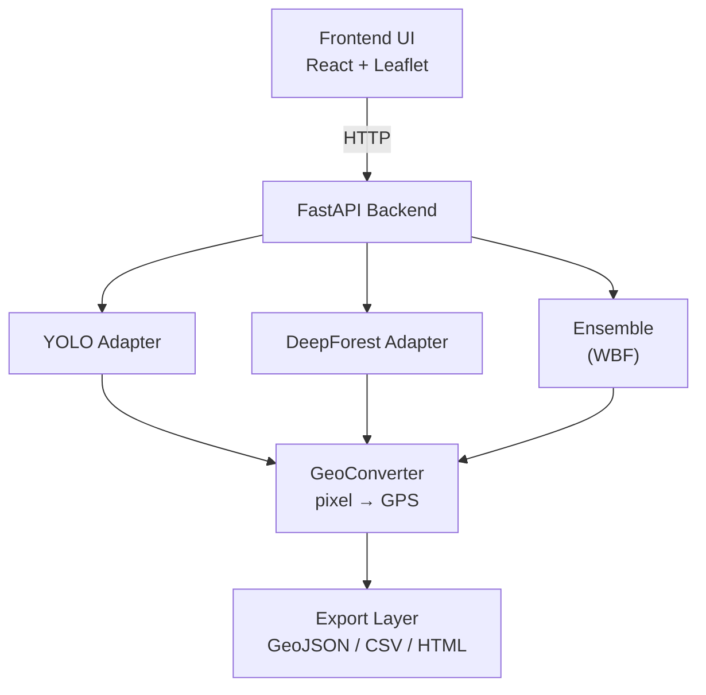

# Astana Tree Detection — Working Prototype

End-to-end система для автоматической инвентаризации городских деревьев Астаны по спутниковым снимкам.

- **Diploma Project** · Astana IT University · 2026
- **Команда:** Anuar Totin · Rasul Aidarkhanov · Berik Sharipov
- **Научный руководитель:** Syndar Satbayev

---

## Что внутри

| Часть | Описание | Стек |
|---|---|---|
| **Backend** | REST API: загрузка снимков, инференс моделей, экспорт результатов | FastAPI, Pydantic, OpenCV |
| **Frontend** | Интерактивный UI: drag-drop загрузка, карта Leaflet, статистика, экспорт GeoJSON/CSV/HTML | React (UMD), Leaflet |
| **ML** | Тренировка моделей, конвертация датасетов, ablation study | YOLOv8, DeepForest, PyTorch |

## Архитектура



## Запуск

### 1. Установить зависимости

```bash
python -m venv venv
venv\Scripts\activate          # Windows
# source venv/bin/activate     # Linux/Mac
pip install -r requirements.txt
```

### 2. Положить веса моделей

```
weights/
  yolo_satellite.pt        # из pipeline/yolov8seg/runs/segment/train/weights/best.pt
  deepforest_astana.pl     # из deepforest/models/astana_trees_v4_10epochs.pl (опционально)
```

### 3. Запустить сервер

```bash
# Windows
start.bat

# Linux/Mac
uvicorn backend.main:app --reload --host 0.0.0.0 --port 8000
```

### 4. Открыть в браузере

http://localhost:8000

## Откуда брать снимки

Три варианта по возрастанию точности:

### A. Capture from map (встроенный)
В UI: кнопка **Capture from map** в зоне загрузки → рисуешь прямоугольник прямо на Leaflet-карте → бэк автоматом скачивает тайлы Esri World Imagery в этой области, склеивает и возвращает уже геопривязанный снимок. Минус: качество ограничено zoom 19 Esri.

Для бо́льших участков (целый район/квартал) есть кнопка **Auto-Zoom Scan** — рисуешь любой большой прямоугольник, сервер сам дробит его на сетку до 9 под-регионов на фикс. zoom 19 и прогоняет каждый. Результаты сохраняются как отдельные snapshots и появляются в **City map** view (см. `FEATURES.md → Auto-Zoom Region Scan`).

### B. Скриншот + draggable corners
Сделал скрин Google Maps / Google Earth → дропнул в UI → на карте появляются два маркера (NW/SE), тащишь их пока твой снимок не ляжет ровно поверх подложки. Координаты в полях обновляются live.

### C. SAS.Planet → GeoTIFF (рекомендуется для финального тестинга)
1. Скачать SAS.Planet (free, [sasgis.org](https://www.sasgis.org/sasplaneta/))
2. В выпадающем «Maps» выбрать **Bing/Esri/Google Satellite**
3. Зум 18–19, найти район Астаны
4. Selection Manager → нарисовать рамкой нужный кусок
5. Operations → **Stitch** → формат **GeoTIFF (.tif)**, projection EPSG:4326 (WGS84)
6. Дропнуть `.tif` в UI → режим геопривязки переключится на **GeoTIFF (auto from file)**, координаты уже внутри файла, ничего вбивать не нужно

## API

| Метод | Путь | Назначение |
|---|---|---|
| `GET`  | `/api/status` | Состояние сервера и моделей |
| `POST` | `/api/upload` | Загрузить снимок (PNG/JPG/TIFF/GeoTIFF) |
| `POST` | `/api/capture_from_map` | Скачать тайлы Esri для bbox → ImageMeta |
| `POST` | `/api/scan_region` | Auto-Zoom Region Scan: bbox → grid под-регионов @ zoom 19 → predict каждого |
| `POST` | `/api/predict` | Запустить детекцию: `{image_id, model, confidence, geo}` |
| `GET`  | `/api/result/{job_id}` | Получить результат |
| `POST` | `/api/export/{job_id}/{fmt}` | Экспорт: `geojson` · `csv` · `html` |
| `GET`  | `/api/history` | История обработанных снимков |

## Разработка

### Структура проекта

```
Astana-Tree-Prototype/
├── backend/             FastAPI сервер
│   ├── main.py          точка входа, роуты
│   ├── schemas.py       Pydantic модели
│   ├── geo.py           pixel → GPS преобразования
│   ├── export.py        GeoJSON / CSV / HTML экспортёры
│   └── models/
│       ├── base.py              ModelAdapter interface
│       ├── yolo_adapter.py      YOLOv8-seg
│       ├── deepforest_adapter.py DeepForest
│       └── ensemble_adapter.py  WBF YOLO + DeepForest
├── frontend/            React UI (no build step, Babel standalone)
│   ├── index.html
│   ├── app.jsx          основной компонент
│   ├── styles.css
│   ├── tweaks-panel.jsx
│   └── api.js           клиент к backend
├── ml/                  обучение и оценка моделей
│   ├── train_yolo.py
│   ├── convert_cvat_to_yolo.py
│   ├── merge_datasets.py
│   └── evaluate.py      ablation: YOLO vs DF vs Ensemble
├── data/                датасеты
├── weights/             обученные модели (gitignored)
└── storage/             runtime: uploads + results (gitignored)
```

### Добавить новую модель

1. Создать `backend/models/my_model_adapter.py`, унаследовать `ModelAdapter`
2. Реализовать `predict(image_path) -> List[Detection]`
3. Зарегистрировать в `backend/main.py:_load_models()`
4. Добавить опцию в дропдаун `frontend/app.jsx:DetectionControls`

## Известные ограничения

- YOLO обучен на ~134 кадра LabelMe + 15 новых из CVAT — доменное смещение может быть значительным
- На satellite low-res (Z17–Z19) границы крон inherently ambiguous → метрики mAP могут недооценивать практическую полезность
- Ensemble через Weighted Box Fusion требует калибровки confidence-весов
- DeepForest требует patch_size ≥ 800 для адекватной детекции на высокоразрешающих снимках
